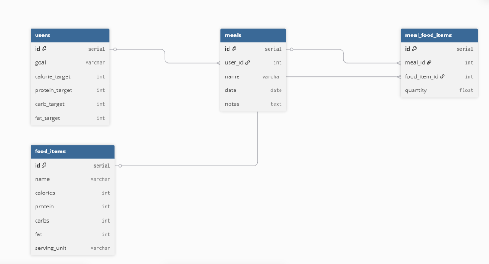

# Entity Relationship Diagram

Reference the Creating an Entity Relationship Diagram final project guide in the course portal for more information about how to complete this deliverable.

## Create the List of Tables

Table users {
  id serial [pk]
  goal varchar
  calorie_target int
  protein_target int
  carb_target int
  fat_target int
}

Table meals {
  id serial [pk]
  user_id int [ref: > users.id]
  name varchar
  date date
  notes text
}

Table food_items {
  id serial [pk]
  name varchar
  calories int
  protein int
  carbs int
  fat int
  serving_unit varchar
}

Table meal_food_items {
  id serial [pk]
  meal_id int [ref: > meals.id]
  food_item_id int [ref: > food_items.id]
  quantity float
}

## Add the Entity Relationship Diagram

